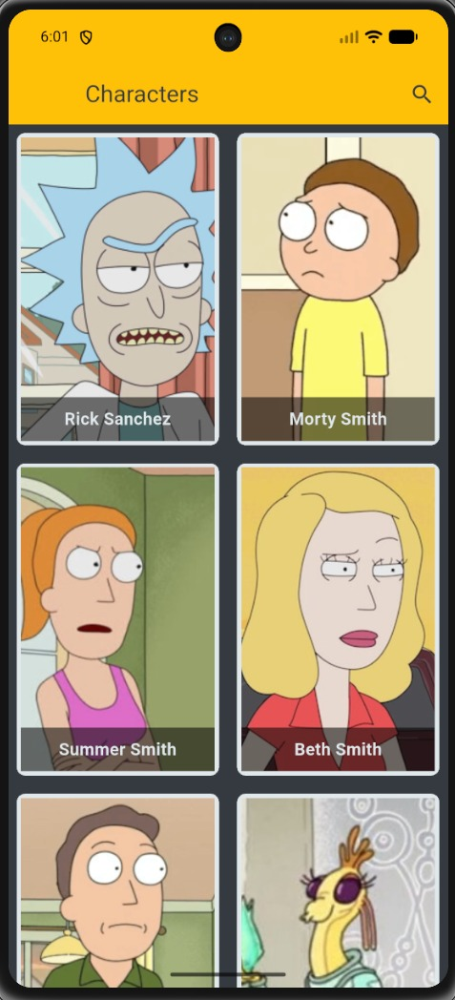
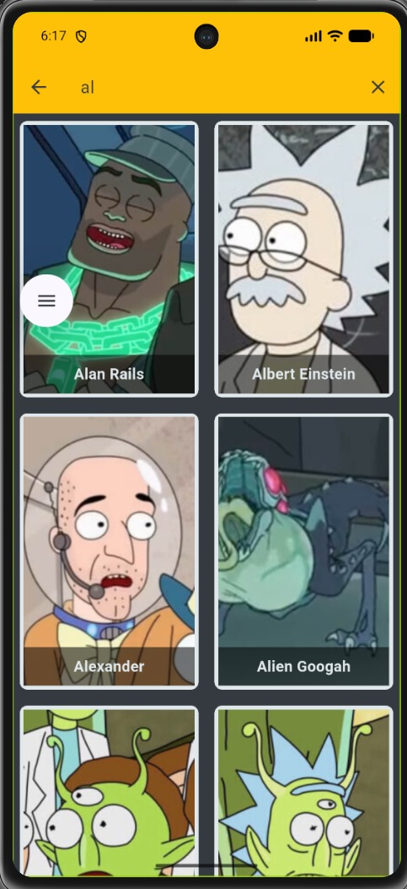
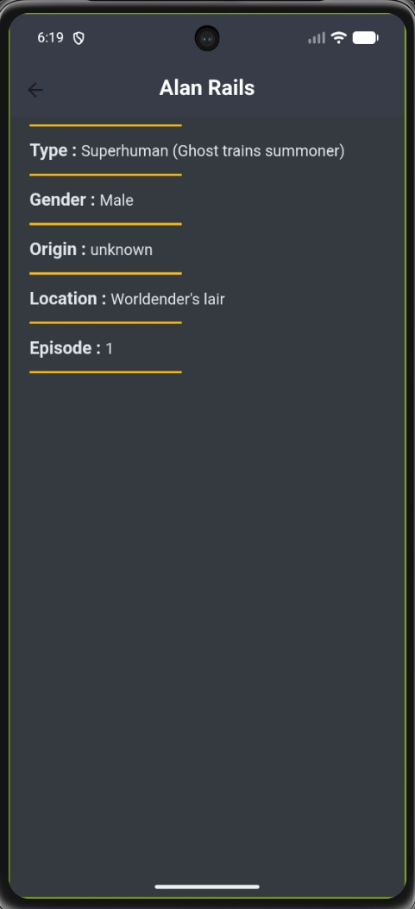

# Rick And Morty Characters App

A Flutter application that displays characters from the Rick and Morty API with a clean UI, character details screen, and search functionality.

## 📱 Screenshots

### Home Screen


### Search


### Details Screen


### All Details Screen


## ✨ Features

- Fetch characters from Rick and Morty API
- Search characters by name
- Character details screen
- Clean and responsive UI
- State management using Cubit
- API handling using Dio
- Custom routing
- Loading and error states

---

## 🛠️ Tech Stack

- Flutter
- Dart
- flutter_bloc
- Cubit
- Dio
- Rick and Morty API

---

## 📂 Project Structure

```bash
lib
├── business_logic
│   └── cubit
├── constants
├── data
│   ├── models
│   ├── repos
│   └── web_services
├── presentation
│   ├── screens
│   └── widgets
├── app_router.dart
└── main.dart
